# TryHackMe: Hashing Basics

**Path:** Cyber Security 101 → Cryptography → Hashing Basics
**Difficulty:** Premium room
**Focus:** Hash functions, integrity checking, password cracking with online tools, rainbow tables, and hashcat

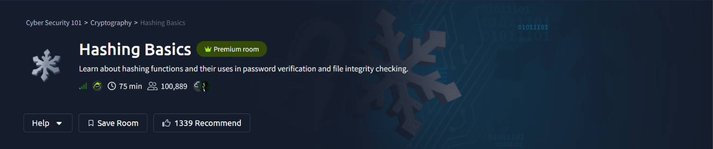

This room covers hashing from the ground up — what makes a hash function useful, how it's used for file integrity and password storage, why unsalted hashes are dangerous, and hands-on password cracking with rainbow tables, online lookup tools, and `hashcat`.

---

## Task 2 — Hash Functions & Their Properties

Every hash function shares a few core properties: it's deterministic, fast to compute, and (ideally) collision-resistant. The room ties this to a very common real-world use case — verifying file integrity.

```bash
sha256sum passport.jpg
```

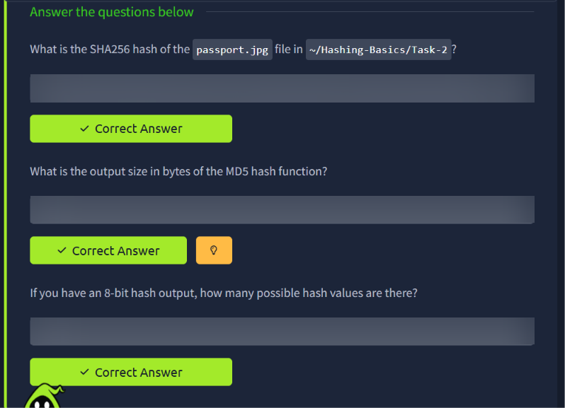

Running `sha256sum` against the target file produces its unique fingerprint — if even a single byte of the file changes, the entire hash output changes completely (the avalanche effect). This is exactly how software vendors let you confirm a downloaded file hasn't been corrupted or tampered with in transit.

The room also drives home the math behind hash space size:

- **MD5** always outputs a **16-byte** digest, regardless of input size.
- An **8-bit** hash has exactly **2⁸ = 256** possible output values — which is exactly why short hash outputs are so vulnerable to collisions and brute-forcing.

---

## Task 3 — Why Unsalted Hashes Get Cracked

This task uses the real 2012 LinkedIn breach as a case study — LinkedIn stored user passwords using unsalted SHA-1, meaning identical passwords across different accounts produced identical hashes, making mass cracking with wordlists trivial.

```bash
head -n 20 /usr/share/wordlists/rockyou.txt
```

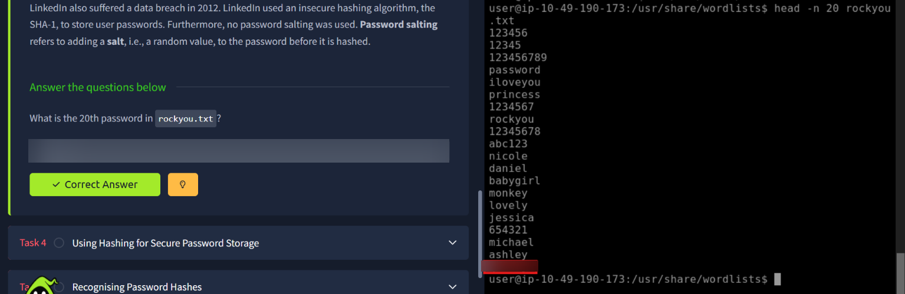

`rockyou.txt` is the classic leaked password wordlist used across nearly every password-cracking exercise — pulling the Nth line straight from the file demonstrates just how predictable (and previously breached) common passwords really are. *(20th entry redacted above — try it yourself!)*

---

## Task 3 (cont.) — Cracking a Hash with an Online Tool

With no salt in place, a leaked hash can simply be pasted into an online lookup service that maintains massive precomputed hash databases.

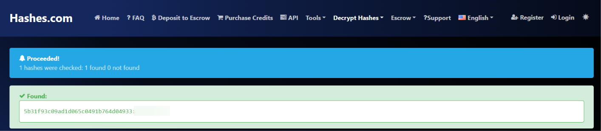

Submitting the hash to **Hashes.com** returns an immediate match — proof of how quickly unsalted, common passwords fall to lookup services with zero brute-forcing required.

---

## Task 3 (cont.) — Rainbow Tables & the Salting Verdict

A **rainbow table** is a precomputed table of hash-to-plaintext mappings, used to reverse hashes far faster than brute-forcing them live. The room provides a small rainbow table and asks for a manual lookup, followed by the same hash cracked via an online tool for comparison.

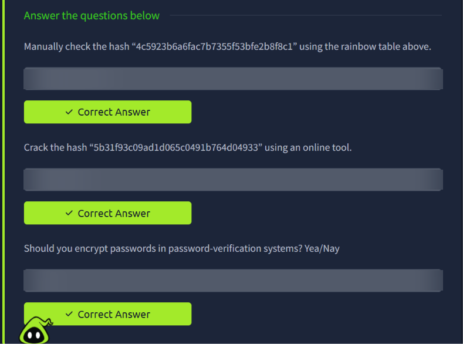

The final question in this task asks the obvious follow-up: should passwords be **encrypted** (reversible) in a verification system, or **hashed** (one-way)? The answer is a firm **no** to encryption — passwords should always be hashed (with a salt), since encryption implies the plaintext can be recovered if the key is ever compromised, while a properly salted hash cannot be reversed even with full database access.

---

## Task 4/5 — Recognising Hash Types

Different systems use different hashing schemes, each identifiable by their prefix, length, or format. This task walks through identifying algorithms used by real-world systems:

- **yescrypt** — a modern, memory-hard password hashing scheme (used by default on newer Linux distros) — produces a **256**-bit hash.
- **Cisco-ASA MD5** — identifiable via `hashcat`'s example-hash reference, which lists the hash-mode number needed to target it with `hashcat -m`.

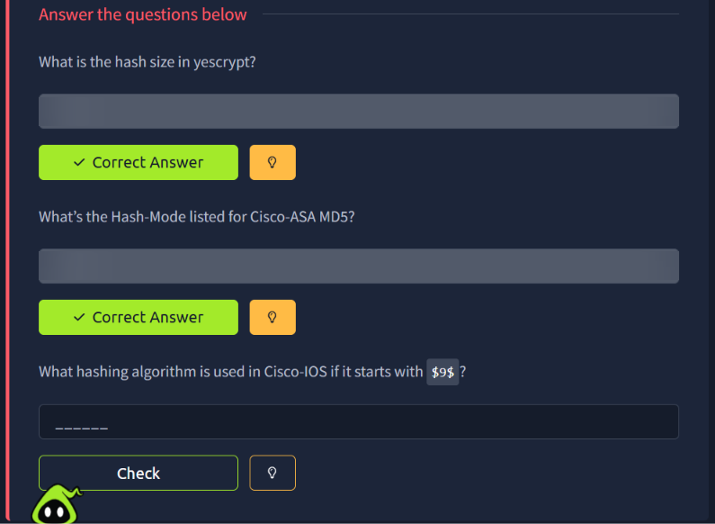

The technique here is looking up `hashcat`'s [example hashes page](https://hashcat.net/wiki/doku.php?id=example_hashes), which maps every supported hash type to its mode number and example format:


The same reference table is used to identify **Cisco-IOS `$9$`** hashes, which is `hashcat`'s notation for the **scrypt**-based scheme newer Cisco devices use for `enable secret` passwords:

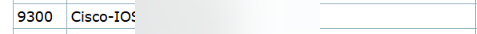

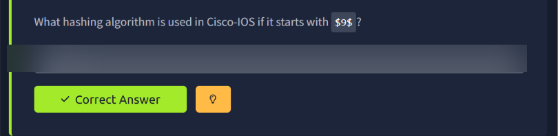

---

## Task 6 — Cracking Hashes with hashcat

This is the core practical task — using `hashcat` to brute-force/dictionary-attack four different hash types, each requiring the correct mode number identified from the technique above.

### Hash 1 — bcrypt

```bash
hashcat -m 3200 -a 0 hash1.txt /usr/share/wordlists/rockyou.txt
```

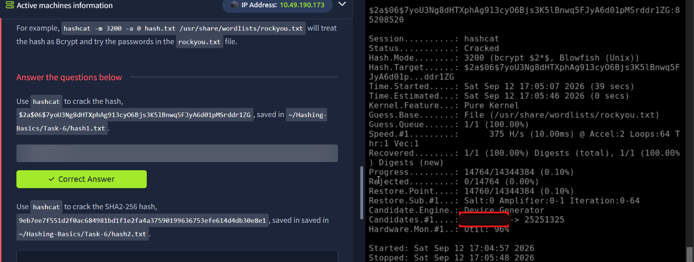

`hashcat` identifies the mode as **3200 (bcrypt $2*$, Blowfish (Unix))** and successfully recovers the plaintext from the target hash using the rockyou wordlist.

### Hash 2 — SHA2-256

```bash
hashcat -m 1400 -a 0 hash2.txt /usr/share/wordlists/rockyou.txt
```

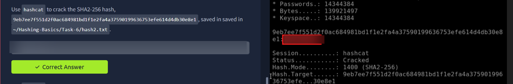

Mode **1400 (SHA2-256)** cracks near-instantly given how fast unsalted SHA-256 is to compute — a good illustration of why fast hash functions make poor password storage choices compared to deliberately slow ones like bcrypt.

### Hash 3 — sha512crypt

```bash
hashcat -m 1800 -a 0 hash3.txt /usr/share/wordlists/rockyou.txt
```

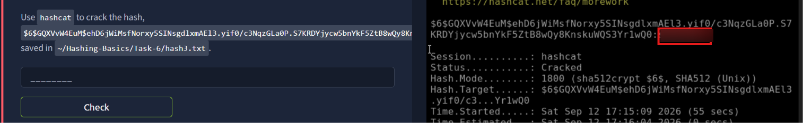

Mode **1800 (sha512crypt $6$, SHA512 (Unix))** — the standard scheme for modern `/etc/shadow` entries on Linux — is cracked using the same wordlist approach.

### Hash 4 — Cracked via online tool

```bash
# Hash saved to ~/Hashing-Basics/Task-6/hash4.txt
```

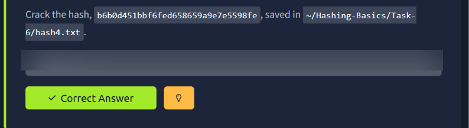

For the last hash, an online cracking service does the job just as effectively as a local wordlist attack:

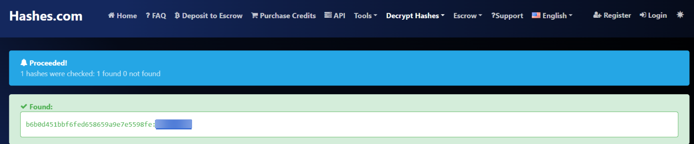

---

## Task 7 — Hashing in Practice: Verifying Downloads & HMAC Modes

Rounding out the room with two more real-world applications of hashing.

```bash
cd ~/Hashing-Basics/Task-7
sha256sum libgcrypt-1.11.0.tar.bz2
```

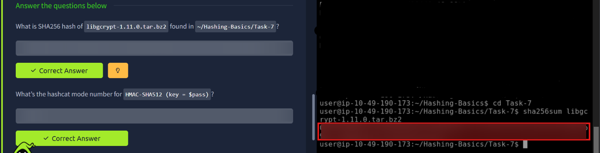

This mirrors exactly how you'd verify a downloaded package against a publisher's published checksum before installing it — a critical supply-chain integrity check. The task also asks for the `hashcat` mode number for **HMAC-SHA512 (key = $pass)**, reinforcing that HMAC constructions (keyed hashing) get their own distinct mode numbers separate from plain hash functions.

---

## Task 8 — Bonus: Encoding vs. Hashing

A quick but important distinction to close out the room: **encoding is not hashing**. Base64 is reversible by design — it's meant for safely representing binary data as text, not for security.

```bash
base64 -d decode-this.txt
```

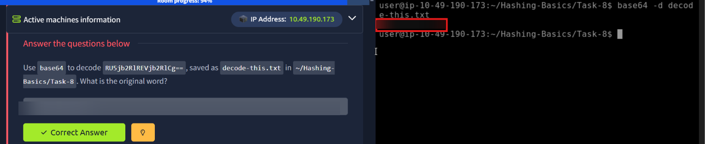

Trivially reversing the string proves the point: Base64 offers **zero** confidentiality or integrity guarantees. Mistaking encoding for encryption or hashing is a common and dangerous misconception.

---

## Summary

| Concept | Real-World Application |
|---|---|
| `sha256sum` | File integrity verification |
| Unsalted hashes | Why the 2012 LinkedIn breach was so damaging |
| Rainbow tables | Precomputed hash reversal |
| Hashing vs. encryption | Why passwords must never be encrypted, only hashed |
| `hashcat` mode numbers | Targeting bcrypt, SHA-256, sha512crypt, and vendor-specific hashes |
| Base64 | Encoding ≠ hashing ≠ encryption |

This room ties together the theory of hashing with the exact tools used to attack and defend it in practice — from spotting a hash type by its format, to picking the right `hashcat` mode, to understanding *why* slow, salted hashing schemes exist in the first place.

---

*Flag values, cracked passwords, and quiz answers have been redacted from screenshots — commands and technique are shown in full so you can reproduce every step yourself.*
